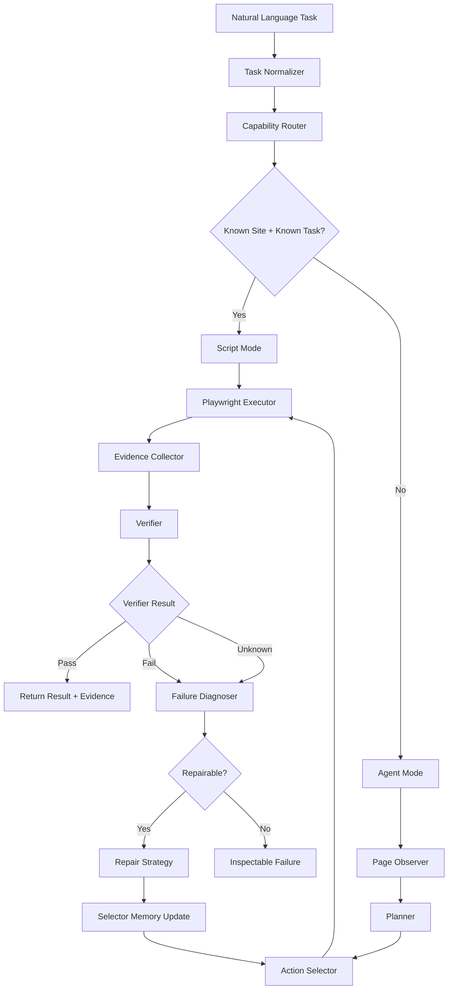
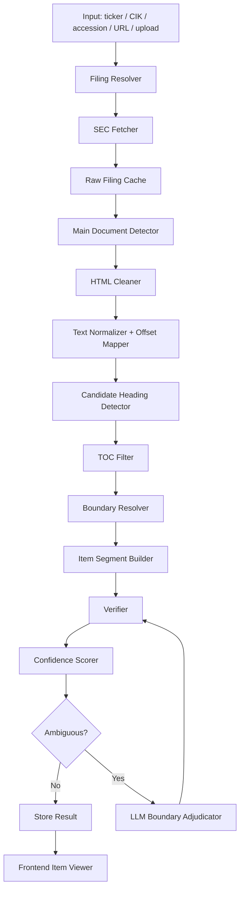

# AI Coding Test 2026 — 雙題碾壓式滿分最終 SPEC

> 本文件為 PM 提供之原始 SPEC,逐字保存,作為所有開發決策的最高依據。
> 收到日期:2026-07-10。

## 0. 核心目標

本專案不是交兩個 demo,而是交一套具備完整評估、證據、失敗分析、成本紀律與 AI 協作紀錄的產品級系統。

本專案同時完成兩題:

- 題目一:泛用瀏覽器自動化 Agent
- 題目二:SEC 10-K 財報 Item-level 結構化抽取

最終交付不是「能跑就好」,而是要讓評審明確看到:

1. 系統知道自己什麼時候成功
2. 系統知道自己什麼時候失敗
3. 系統知道自己什麼時候證據不足
4. 每個結果都有 evidence
5. 每個錯誤都能回放與分析
6. 每次 AI 協作都有 prompt / decision / result 紀錄
7. 每次 commit / push 都能反映真實開發過程
8. 每個功能都對應評分標準

## 1. 最高原則

### 1.1 評分標準優先

任何功能、架構、prompt、commit、文件、前端畫面、eval case、修 bug,都必須回到評分標準。

| 評分項目 | 系統必須展示的能力 |
|---|---|
| 評估紀律 | 有 eval set、有 metrics、有 held-out、有失敗案例 |
| 系統性思考 | 有分層架構、有 verifier、有 fallback、有 failure taxonomy |
| 工程權衡 | 有成本、延遲、可靠性、擴充性分析 |
| AI 協作品質 | 有 prompt 紀錄、有 AI 決策紀錄、有 rejected suggestions |
| 正確性驗證 | 不是 AI 自述成功,而是 evidence-backed verification |
| 失敗處理 | 失敗能診斷、能修復、能標 unknown |
| 可觀測性 | 每次 run 有 trace、log、artifact、confidence、status |
| 誠實邊界 | 明確列出支援、不支援、不穩定案例 |

### 1.2 AI 不能只照人類 prompt 做事

AI coding agent 不應該只在使用者明確要求時才做以下事情:

commit、push、寫 prompt 紀錄、更新 README、補 eval case、補 failure case、更新 report、修正 spec、新增 verifier、補 cost / latency 分析、記錄 AI decision、標記 rejected design。

AI 必須主動判斷。判斷依據不是「使用者有沒有說」,而是:

- 這件事是否影響評分標準?
- 這件事是否影響可驗證性?
- 這件事是否影響 repo 的可信度?
- 這件事是否應該被評審看到?
- 這件事是否代表一次真實開發決策?

只要答案是 yes,AI 就必須主動處理或提出明確 action。

## 2. 專案總架構

本專案是雙系統共用一套底層 reliability infrastructure。

```
ai-coding-test-2026/
  apps/
    web/
      browser-agent/
      sec-extractor/
      eval-dashboard/
  services/
    browser-agent-api/
    sec-extractor-api/
    eval-runner/
    evidence-store/
  packages/
    browser-core/
    sec-core/
    eval-core/
    llm-core/
    observability-core/
  data/
    browser_eval/
    sec_eval/
    mock_sites/
    golden_labels/
  prompts/
    browser_agent/
    sec_extractor/
    eval_design/
    failure_triage/
    rejected_prompts/
  docs/
    architecture.md
    browser_agent_spec.md
    sec_extractor_spec.md
    eval_report.md
    cost_latency_report.md
    failure_gallery.md
    ai_collaboration_report.md
    supported_and_unsupported.md
  README.md
```

## 3. 最終公開前端

必須至少提供三個公開可操作頁面。

| 頁面 | 目的 |
|---|---|
| Browser Agent | 輸入自然語言任務,觀看 browser agent 執行、修復、驗證 |
| SEC Extractor | 輸入 ticker / CIK / accession / URL / upload,檢視抽出的 10-K items |
| Eval Dashboard | 檢視兩題 eval 結果、成本、延遲、失敗案例、prompt 紀錄 |

前端不是展示 UI 而已,必須展示判斷能力。

每個 run 都要能看到:input、plan、steps、tool calls、evidence、verifier result、confidence、cost、latency、failure reason、repair attempt、final status。

## 4. 共用 Evidence-first 設計

### 4.1 成功不能只靠 AI 自述

任何成功都必須有 evidence。

- AI 說成功 ≠ 成功
- 工具回傳成功 ≠ 成功
- 畫面看起來完成 ≠ 成功
- 有 verifier 判定 + evidence chain 才能算成功

### 4.2 三態判定

所有任務最終只能是:

| 狀態 | 意義 |
|---|---|
| pass | 有足夠 evidence 證明完成 |
| fail | 有 evidence 證明錯誤 |
| unknown | evidence 不足,不能宣稱成功 |

unknown 不是失敗,而是誠實邊界。C 級系統會把 unknown 偽裝成 success。A+ 系統會標 unknown,並說清楚缺什麼 evidence。

## 5. 共用 Evidence Schema

```typescript
type EvidenceRecord = {
  run_id: string
  app: "browser_agent" | "sec_extractor"
  step_id: string
  timestamp: string
  input_hash: string
  output_hash: string
  tool_used: string
  llm_model?: string
  cost_usd?: number
  latency_ms: number
  status: "pass" | "fail" | "unknown" | "partial"
  evidence_type:
    | "screenshot"
    | "trace"
    | "dom_snapshot"
    | "source_span"
    | "html_offset"
    | "log"
    | "metric"
    | "llm_judgment"
    | "download_artifact"
  artifact_path: string
  verifier_result: {
    status: "pass" | "fail" | "unknown"
    reason: string
    required_evidence: string[]
    observed_evidence: string[]
    missing_evidence: string[]
  }
}
```

## 6. 題目一:泛用瀏覽器自動化 Agent

### 6.1 產品定位

做一個 capability-aware browser agent。它不是黑箱亂點網站,而是:可以理解任務、選擇策略、執行瀏覽器操作、收集 evidence、驗證成功、診斷失敗、自我修復 selector、誠實標示不支援或 unknown。

### 6.2 Browser Agent 架構



### 6.3 三種執行模式

| 模式 | 目的 | 使用時機 |
|---|---|---|
| Script Mode | 穩定、低成本、可重現 | 已知網站、已知任務 |
| Agent Mode | 處理未知任務 | 網站或流程未預先定義 |
| Repair Mode | 自我維護 | selector 壞掉、UI 變動、click 無效 |

工程權衡:已知任務不應該全部丟給 LLM。LLM 只在不確定、未知、需要修復時升級使用。

### 6.4 Browser Agent 支援範圍

README 與前端必須明確列出。

| 類型 | 支援狀態 | 說明 |
|---|---|---|
| 公開網站搜尋 | 支援 | 搜尋、開結果、擷取 visible data |
| 公開文件下載 | 支援 | PDF / HTML / CSV 等公開檔案 |
| 表單填寫 | 部分支援 | 僅限公開、可逆、無登入、無金流 |
| 多頁導航 | 支援 | 可追蹤 URL、title、DOM 狀態 |
| 資料擷取 | 支援 | 擷取文字、表格、連結、下載檔 |
| 登入 | 不支援 | 涉及憑證與安全 |
| CAPTCHA | 不支援 | 反自動化機制 |
| 購買 / 下單 | 不支援 | 高風險不可逆操作 |
| 發文 / 送出正式表單 | 預設不支援 | 有 side effect |
| 付費資料 | 不支援 | 題目要求公開或自建資料 |

### 6.5 Browser Action Schema

LLM 不得直接輸出任意 Playwright code。LLM 只能輸出受控 action JSON。

```typescript
type BrowserAction =
  | { type: "goto"; url: string }
  | { type: "click"; target: ElementTarget }
  | { type: "fill"; target: ElementTarget; value: string }
  | { type: "press"; target: ElementTarget; key: string }
  | { type: "select"; target: ElementTarget; value: string }
  | { type: "scroll"; direction: "up" | "down"; amount: number }
  | { type: "wait_for"; condition: WaitCondition }
  | { type: "extract_text"; target: ElementTarget }
  | { type: "download"; target: ElementTarget }
  | { type: "snapshot" }
  | { type: "back" }
```

原因:安全、可驗證、可重播、可評估、可修復。

### 6.6 Browser Observer

每一步操作後都要收集:URL、page title、screenshot、DOM snapshot、accessibility tree、visible text、candidate elements、previous action、current goal、tool log、latency、cost。

### 6.7 Browser Verifier

每個任務都要轉成 contract。

```typescript
type BrowserTaskContract = {
  task_id: string
  natural_language_task: string
  expected_outcome: string
  success_conditions: {
    type:
      | "url_contains"
      | "text_visible"
      | "download_exists"
      | "table_extracted"
      | "field_value_equals"
      | "screenshot_region_changed"
    value: string
  }[]
  forbidden_conditions: {
    type:
      | "error_text_visible"
      | "captcha_visible"
      | "login_required"
      | "wrong_domain"
    value: string
  }[]
}
```

如果 verifier 無法確認成功,必須標 unknown,不能標 pass。

### 6.8 自我糾錯

自我糾錯不是 try/catch 重跑。必須診斷 failure type。

| Failure Type | 偵測方式 | 修復策略 |
|---|---|---|
| selector_not_found | selector 找不到元素 | 改用 role / text / aria / placeholder |
| multiple_candidates | 命中多個元素 | 根據 role、label、位置、visible text 重新排序 |
| click_no_effect | click 後 URL / DOM 無變化 | 改點 parent / child,或用 Enter |
| modal_blocking | cookie banner / modal 遮擋 | 關閉 modal 或選必要選項 |
| wrong_page | URL / title / expected text 不符 | backtrack 到 checkpoint |
| timeout | wait 超時 | 換 wait condition 或降低任務粒度 |
| form_validation_error | 頁面出現錯誤文字 | 重新填欄位或標 fail |
| empty_result | 搜尋結果為空 | 放寬 query 或標 unknown |
| download_missing | 沒有下載 artifact | 改解析 href 或 network response |
| silent_failure_risk | evidence 不足 | 標 unknown |

### 6.9 自我維護

Browser Agent 必須有 selector memory。

```typescript
type SelectorMemory = {
  site: string
  task_type: string
  element_purpose:
    | "search_box"
    | "submit_button"
    | "result_link"
    | "download_button"
    | "filter_dropdown"
  selector_versions: {
    selector: string
    selector_type: "css" | "xpath" | "role" | "text" | "semantic"
    first_seen: string
    last_seen: string
    success_count: number
    fail_count: number
    last_dom_fingerprint: string
  }[]
  preferred_selector: string
  repair_history: RepairEvent[]
}
```

當 UI 變動時:舊 selector 失敗 → DOM fingerprint 比對 → 找相似 candidate → 根據 role / label / text / position 排序 → 小步驗證 → verifier pass → 更新 selector memory → 重新執行任務。

前端必須顯示:舊 selector 是什麼、為什麼失敗、新 selector 候選有哪些、選擇哪一個、為什麼選它、修復是否成功、evidence 是什麼。

### 6.10 Browser Eval Set

Browser eval 必須分層。

| Eval 類型 | 目的 |
|---|---|
| Public website eval | 測真實網站可靠性 |
| Mock website eval | 測 UI 變動與自我維護 |
| Adversarial eval | 測錯誤處理與 silent failure |
| Held-out eval | 測未見過任務泛化 |

Mock site 必須故意製造 UI 變動:button id 改變、placeholder 改變、aria-label 改變、button text 改變、出現 cookie modal、lazy loading、兩個相似 search box、download button 改成 icon、結果排序不同、假按鈕 deceptive button。

### 6.11 Browser Metrics

| Metric | 說明 |
|---|---|
| task success rate | 支援任務完成率 |
| verifier false positive rate | 錯了卻標成功的比例 |
| silent failure rate | 沒證據卻宣稱成功的比例 |
| repair success rate | UI 變動後自修復成功率 |
| average steps per task | 任務平均步數 |
| average latency | 平均耗時 |
| average cost | 平均 LLM 成本 |
| trace completeness | 每次 run 是否都有 trace |
| failure explainability | failure 是否有分類與原因 |

## 7. 題目二:SEC 10-K Item-level 結構化抽取

### 7.1 產品定位

做一個能從原始 10-K filing 抽取 Item 1–16 的 pipeline。重點不是 regex 切文字,而是:處理格式變異、TOC 假 heading、amendment、incorporated by reference、missing item、ambiguous boundary,提供 confidence、source span evidence、failure case。

### 7.2 SEC 抽取最高原則

LLM 不得直接產生 item text。所有 item text 必須是 source exact span。LLM 只能協助判斷 ambiguous boundary。

理由:避免 hallucination、降低成本、提高可重現性、可以對應 source span、可以驗證 boundary。

### 7.3 SEC Pipeline



### 7.4 支援輸入

| 輸入 | 行為 |
|---|---|
| ticker + year | 查公司 filing |
| CIK + year | 查公司 filing |
| accession number | 直接定位 filing |
| SEC URL | 解析 filing |
| HTML upload | 離線抽取 |
| TXT upload | 離線抽取,但 confidence 較低 |

### 7.5 SEC Fetcher 要求

必須使用明確 user-agent、rate limit、cache raw filing、保存 raw hash、保存 fetch log、能重跑同一 filing、避免重複下載。

具體 SEC request 規則以實作當下官方文件為準,不能硬寫過期假設。

### 7.6 Main Document Detector

一個 filing package 裡可能有:主 10-K HTML、exhibits、XBRL instance、inline XBRL、圖片、CSS、附錄。

主文件 scoring:

| Signal | 分數方向 |
|---|---|
| document type 是 10-K / 10-K/A | 加分 |
| 內文包含 Item 1A / Item 7 / Item 8 | 加分 |
| 文件長度最大 | 加分 |
| filename 含 10k / form10-k | 加分 |
| exhibit | 扣分 |
| XML / XSD | 扣分 |
| 只有 cover page | 扣分 |

### 7.7 Normalizer

輸出:raw_html、normalized_html、normalized_text、offset_mapping、line_mapping。

處理:移除 script / style、保留 heading tag、decode HTML entities、normalize NBSP、normalize unicode dash、collapse repeated whitespace、保留 table text、標記 Table of Contents zone、標記 anchor links、建立 raw offset 到 normalized offset mapping。

### 7.8 Heading Candidate Detector

支援 heading 格式:

- `Item 1. Business`
- `ITEM 1A. RISK FACTORS`
- `Item 1C — Cybersecurity`
- `ITEM 7 Management's Discussion and Analysis`
- `Item 7A. Quantitative and Qualitative Disclosures About Market Risk`
- `ITEM 9C. Disclosure Regarding Foreign Jurisdictions that Prevent Inspections`

Detector 不只一種:

| Detector | 用途 |
|---|---|
| strict line regex | 乾淨 heading |
| loose heading regex | 異常格式 |
| DOM heading detector | h1 / h2 / b / strong / font-size |
| anchor detector | TOC anchor |
| visual layout detector | 空白、短行、大寫 |
| sequence detector | item 順序合理性 |

### 7.9 TOC False Positive 防禦

Table of Contents 是最大陷阱。

TOC 假 heading 特徵:大量 item heading 出現在文件前段、heading 後面接 page number、有 dotted leaders、附近出現 Table of Contents、item heading 距離過近、anchor 指向後文、周圍內容太短。

TOC filter 必須能解釋:這個 candidate 為什麼像 TOC、為什麼被排除、真正正文 candidate 在哪裡。

### 7.10 Boundary Resolver

item boundary 不是只找 start。Item X start = Item X 最佳 heading。Item X end = 下一個有效 item heading。

特殊情況:

| Case | 處理 |
|---|---|
| Item 1 and 2 combined | 兩個 item 指向同 span,但加 warning |
| Item 6 reserved | 可標 reserved / missing |
| Item 10–14 incorporated by reference | 抽引用文字,不假裝完整 |
| 10-K/A | 標 amendment mode |
| item 缺失 | status = missing |
| 多候選接近 | status = ambiguous 或啟用 LLM adjudicator |
| 掃描 PDF | status = unsupported |

### 7.11 Item Segment Schema

```typescript
type ItemSegment = {
  filing_id: string
  item_code:
    | "1" | "1A" | "1B" | "1C"
    | "2" | "3" | "4" | "5" | "6"
    | "7" | "7A" | "8" | "9" | "9A" | "9B" | "9C"
    | "10" | "11" | "12" | "13" | "14" | "15" | "16"
  canonical_title: string
  extracted_heading: string
  start_offset: number
  end_offset: number
  text_sha256: string
  status:
    | "pass"
    | "partial"
    | "missing"
    | "ambiguous"
    | "incorporated_by_reference"
    | "reserved"
    | "unsupported"
  confidence: number
  warnings: string[]
  evidence: BoundaryEvidence[]
}
```

### 7.12 Confidence Scoring

Confidence 不能是 LLM 感覺。

```
confidence =
  heading_strength
+ title_similarity
+ sequence_consistency
+ toc_disambiguation
+ boundary_length_sanity
+ cross_detector_agreement
+ verifier_result
```

每個分數都必須可解釋。前端必須顯示:總 confidence、每個 component 分數、扣分原因、warning、source evidence。

### 7.13 LLM Boundary Adjudicator

只有 ambiguous 時使用。

輸入:item code、canonical title、candidate A context、candidate B context、sequence context、detector scores。

輸出只能是 JSON:

```json
{
  "decision": "candidate_a | candidate_b | unknown",
  "confidence": 0.0,
  "evidence_quote": "exact quote from source",
  "reason": "short reason"
}
```

禁止:產生 filing text、摘要、改寫、沒有 quote 卻高信心。不確定必須 unknown。

### 7.14 SEC Eval Set

| 類型 | 目的 |
|---|---|
| 大型科技公司 | baseline |
| 金融公司 | 長 Item 7 / Item 8 |
| 零售 / 製造 | 一般格式 |
| 能源 / 礦業 | Item 4 等特殊案例 |
| 生技 / 小型公司 | 格式變異 |
| 10-K/A | amendment |
| 老 filing | 舊 HTML |
| inline XBRL heavy | 現代 filing |
| bad HTML | parser 壓力測試 |
| incorporated Part III | Item 10–14 proxy reference |

至少需要:分層 eval set、manual golden labels、weak labels、spot check、held-out filings、failure gallery。

### 7.15 SEC Metrics

| Metric | 說明 |
|---|---|
| item coverage | 應抽 item 是否抽到 |
| boundary token IoU | 抽取 span 與標註 span 重疊率 |
| high-confidence precision | 高信心結果是否真的對 |
| silent failure rate | 錯了卻標成功 |
| TOC false positive rate | 把 TOC 當正文的比例 |
| missing item correctness | 是否正確標 missing / reserved |
| LLM fallback rate | ambiguous 使用 LLM 的比例 |
| average cost per filing | 每份 filing 成本 |
| parser latency | parse 耗時 |
| confidence calibration | confidence 是否對應實際正確率 |

## 8. Eval Dashboard

Eval Dashboard 是本專案的碾壓點。它不是附屬功能,而是評審看到系統品質的入口。

### 8.1 必須顯示

| 區塊 | Browser Agent | SEC Extractor |
|---|---|---|
| Overview | success / fail / unknown | coverage / boundary accuracy |
| Run Detail | screenshot / trace / action log | source span / candidate heading |
| Failure Gallery | selector fail / wrong page | TOC fail / ambiguous boundary |
| Cost | LLM call / browser runtime | SEC fetch / LLM fallback |
| Latency | step latency | fetch / parse / verify |
| Prompt Log | planner / repair prompt | boundary adjudicator prompt |
| Eval Set | task list | filing list |
| Held-out Result | unseen website tasks | unseen filings |

## 9. Failure Gallery

每個 failure 都要像事故報告:Failure ID、App、Input、Expected、Actual、Status、Failure Type、Evidence、Root Cause、Repair Attempt、Why It Still Failed、Next Fix、Related Prompt、Related Commit。

Failure 不是扣分項。沒有 failure analysis 才是扣分項。

## 10. Prompt 紀錄規範

### 10.1 Prompt 不是只有使用者寫的 prompt

`prompts/` 必須保存:使用者給 AI 的 prompt、AI 主動產生給 coding agent 的 prompt、AI 主動產生給 reviewer agent 的 prompt、AI 用來診斷 failure 的 prompt、AI 用來設計 eval 的 prompt、AI 用來修 bug 的 prompt、AI 被拒絕的設計 prompt、AI 自己判斷需要補文件時使用的 prompt、AI 自己判斷需要補測試時使用的 prompt。

不是使用者要求才寫 prompt。只要 AI 有用 prompt 影響設計、程式、eval、文件、修復,就必須記錄。

### 10.2 Prompt 檔案格式

```markdown
# Prompt Title
## Trigger
為什麼這次需要 prompt?是使用者要求、AI 自主判斷、failure triage、eval 補強,還是設計審查?
## Scoring Criteria
這次 prompt 對應哪個評分標準?
## Prompt
實際 prompt。
## AI Output Summary
AI 回覆重點。
## Human / PM Decision
採納什麼?拒絕什麼?修改什麼?
## Reason
為什麼這樣決策?
## Resulting Change
對應的 code / doc / eval / commit。
```

## 11. Commit / Push 規範

### 11.1 AI 必須主動判斷何時 commit

以下情況必須主動 commit:完成一個可驗證功能、完成一個 eval case、完成一個 verifier、修復一個 failure type、新增一個 prompt 紀錄、更新 README 的支援 / 不支援範圍、新增 failure gallery case、完成一個可重跑 pipeline step、完成一個前端可視化頁面、修正會影響評分標準的設計、新增成本 / 延遲 / 正確性分析。

### 11.2 AI 必須主動判斷何時 push

以下情況必須主動 push:完成可展示 milestone、完成可部署版本、完成一組 eval 結果、完成 README / report 更新、完成前端可公開驗證功能、完成重大 bug 修復、完成一組 prompt log、完成 failure gallery 更新。

push 前必須確認:tests pass、lint pass、eval runner 可執行、README 沒有過期、prompt log 已更新、commit message 清楚、沒有 secret、沒有 private data。

### 11.3 Commit message 格式

```
feat(browser): add verifier-backed task contract
feat(browser): add selector repair memory
feat(sec): add toc false-positive filter
feat(sec): add boundary confidence scorer
eval(browser): add adversarial mock-site tasks
eval(sec): add manually labeled 10-k boundary cases
docs: add ai collaboration prompt log
docs: add failure gallery case for toc boundary error
fix(browser): classify click-no-effect as repairable failure
fix(sec): prevent toc headings from being selected as item starts
```

Commit history 要能讓評審看出:真實開發過程、逐步設計、逐步評估、逐步修 bug、AI 協作不是裝飾。

## 12. AI 自主決策規範

AI coding agent 每次工作都要自問:

這次改動對應哪個評分標準?有沒有 evidence?有沒有 verifier?有沒有 eval?有沒有 failure case?有沒有 prompt log?README 需不需要更新?report 需不需要更新?需不需要 commit?需不需要 push?有沒有可能造成 silent failure?

如果其中任何答案是 yes,AI 必須主動處理。

## 13. README 必須包含

Live Demo URLs、系統總覽、題目一 Browser Agent 說明、題目二 SEC Extractor 說明、支援網站與操作、不支援網站與操作、SEC 支援 filing 類型、SEC 困難 filing 類型、如何本機執行、如何跑 eval、Eval 結果摘要、成本 / 延遲摘要、已知限制、Failure Gallery 入口、Prompt Logs 說明、AI 協作方式、Commit history 說明。

## 14. 分析報告必須包含

### 14.1 eval_report.md

Browser Agent eval set / metrics / held-out result / failure cases;SEC Extractor eval set / metrics / held-out result / failure cases;confidence calibration;silent failure analysis。

### 14.2 cost_latency_report.md

Browser Agent LLM cost、browser runtime latency、repair latency;SEC fetch cost、parser latency、LLM fallback cost;cache hit rate;scalability estimate;cost control decisions。

### 14.3 ai_collaboration_report.md

AI 用在哪些地方、AI 沒有被允許做哪些事、AI 建議被採納的例子、AI 建議被拒絕的例子、AI 如何主動建立 prompt、AI 如何主動 commit / push、AI 如何對照評分標準工作。

## 15. Browser Agent Killer Demo

1. 在 mock site v1 成功執行搜尋任務
2. 切換到 mock site v2
3. selector 故意失效
4. agent 偵測 selector_not_found
5. agent 使用 accessibility tree 找候選元素
6. agent 小步驗證新 selector
7. verifier 判定成功
8. selector memory 更新
9. 重新執行任務成功
10. 前端顯示完整 repair evidence

命中:自我糾錯、自我維護、silent failure 防範、eval 深度、可觀測性。

## 16. SEC Extractor Killer Demo

1. 選一份有 Table of Contents 的 10-K
2. 顯示 TOC 裡面的假 Item heading
3. 顯示 parser 為什麼拒絕 TOC candidate
4. 顯示真正 Item 1A boundary
5. 點擊 source span highlight
6. 顯示 confidence components
7. 顯示 warning / failure risk
8. 若 ambiguous,顯示 LLM adjudicator 如何只判 boundary
9. 顯示抽取 text 是 source exact span
10. 顯示 eval metric

命中:格式變異穩健性、ground truth 不完整時的驗證方法、edge case 處理、成本紀律、正確性驗證。

## 17. 最終評審印象設計

評審最後應該得到的印象:

- 這個人不是只會 vibe coding。
- 這個人知道 AI coding 之後,真正稀缺的是驗證能力。
- 這個人知道系統會失敗,所以提前設計 evidence、verifier、eval、failure gallery。
- 這個人知道 AI 會亂,所以限制 LLM action space,並保留 prompt decision log。
- 這個人知道 demo 不可信,所以做了 eval dashboard。
- 這個人知道工程不是功能堆疊,而是成本、延遲、可靠性、擴充性的權衡。

## 18. 最終一句話定位

這不是兩個 AI demo。這是一套 AI reliability platform,並用 Browser Agent 與 SEC 10-K Extractor 兩個高難度任務證明它。
