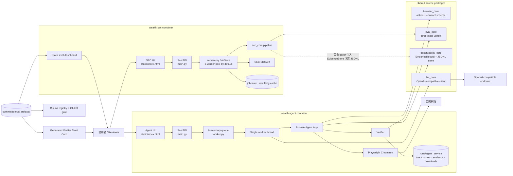
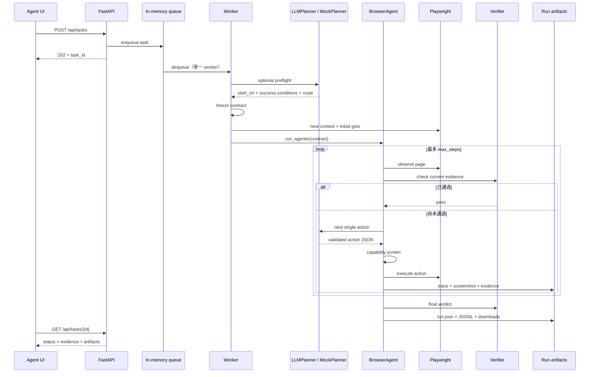
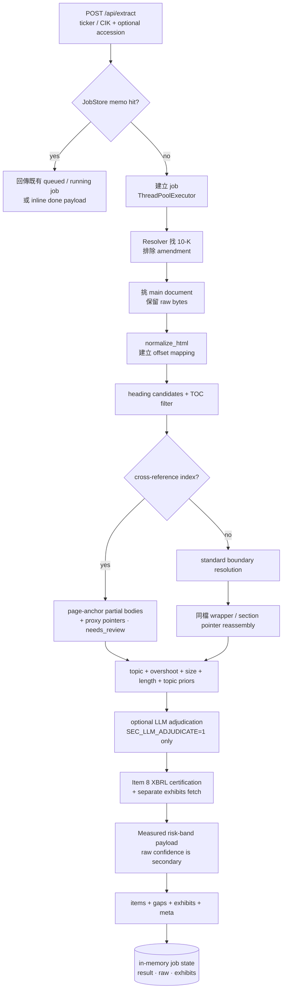
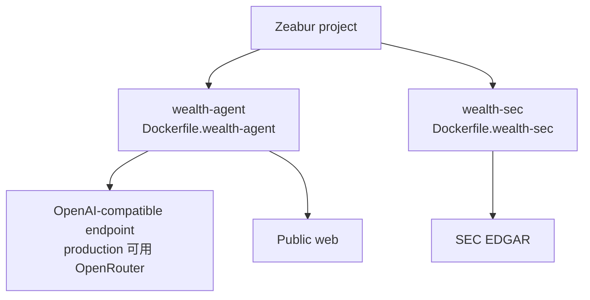

# Wealth Reliability Platform — System Map

> **快照日期：2026-07-15。** 本圖只畫目前 source tree 真正走得到的路徑；`spec.md` / `docs/SPEC.md` 裡只有規劃、尚未接線的內容，不算現況。

**白話：這是一張「現況地圖」，不是「願景圖」。** 架構圖最容易撒的謊，是把「repo 裡躺著這個 module」畫成「線上已經完整接線」。所以我給這份圖設了一道入場券 —— **tree 裡真的有接線、tests 真的能重跑，才准畫上去**。

## 這套系統到底在做什麼？

**一句話：這是一套「AI 可以提議，但不能自己宣布成功」的 reliability platform，拿兩個產品證明同一個原則。**

翻成一般人能懂的版本：AI 是考生，可以盡量作答；但**改考卷的人不能是考生自己**。系統裡永遠留一個獨立的判卷者，它只認證據，不認自述。

- **Browser Agent（會自己操作網頁的 AI）：**替使用者操作公開網站；LLM（大型語言模型，負責出主意的那個 AI）決定下一步，獨立 `verifier`（驗證器，也就是判卷者）檢查結果。
- **SEC Extractor（10-K 年報切段器；10-K 是美國上市公司年報）：**把 10-K 切成可回到原文核對的 Item spans（條目區段）；deterministic pipeline（不含隨機性、每次跑都一樣的固定流程）定邊界，LLM 預設不參與。
- **Eval surface（評測門面）：**把離線評測 artifact（跑完之後存下來的結果檔）做成靜態 dashboard、Verifier Trust Card（替判卷者自己出的成績單）與 claims drift gate（數字漂移攔截閘）；它們是可重算的成績單，不是 production telemetry（線上即時監控）。

### 先攤開骨架：本圖分六件事

| # | 這段回答什麼 | 一句話功能 |
|---|---|---|
| ① | **全景** | 有哪兩個 container、共用哪些 package、誰其實**不**呼叫誰 |
| ② | **兩條請求路徑** | 一個 Browser 任務、一份 10-K，各自怎麼從 request 走到 verdict |
| ③ | **元件責任** | 誰有決定權、誰只能提議 |
| ④ | **狀態與資料** | 東西存在哪、活多久、重啟之後還在不在 |
| ⑤ | **部署** | 上線後怎麼連外、health check 到底證明了什麼 |
| ⑥ | **誠實限制** | 哪些「聽起來明明是對的」主張，其實不成立 |

章序刻意由淺入深：**做了什麼 → 憑什麼信 → 邊界在哪。**

## 這次從 commits 更新了什麼？

**白話：初版 map 的主架構沒錯，但漏了 2026-07-13 已落地的 reviewer / calibration / anti-drift 層。以下五項已完成，不應再寫成 roadmap。**

| 已完成能力 | 實際落地 commit | Source tree 證據 |
|---|---|---|
| 第 5 個 keyless honest-`unknown` demo；verdict 區顯示逐條 evidence、triage、最後 screenshot、calls / tokens / USD / latency | `6f7c2fd` | `worker.py`、Agent UI、11 項 service tests；同一 commit 也實際帶入 Agent 端 reviewer tour UI |
| SEC raw confidence 降級成有實測錯誤率的 risk bands，不再冒充 probability | `5738545` | `risk_band.py`、SEC API / UI、15 項 tests；同一 commit 也實際帶入 SEC 端 reviewer tour UI |
| Verifier Trust Card：反過來替「裁判本身」做 11 項成績單，AUROC MISS 不藏 | `d8d1ac0` | artifact-driven generator、`--check`、byte-stable drift tests |
| Headline claims 綁定 artifacts，CI 重新計算，數字 drift 直接失敗 | `519fdd8` | `claims_registry.json`、`verify_claims.py`、CI gate |
| 雙前端 4-station reviewer tour 的完整測試 | `f8187e7` | 這個 commit 的實際 diff 只有 `tests/test_reviewer_tour.py`；UI 本體已在前兩個 commits 落地 |

我用什麼判定「這件事到底做了沒」？`git blame` / `git show` 的判定比 commit title 更可靠。**不是 title 寫了什麼就算做了，是目前 tree 有接線、tests 能重跑才算。**

最後一列就是這條規矩的自我攻擊示範：`f8187e7` 的 title 讀起來像「做了 reviewer tour」，但我打開 diff 一看，裡面只有 `tests/test_reviewer_tour.py` —— UI 本體其實早在前兩個 commits 就落地了。我照實這樣寫，而不是把功勞挪到看起來最漂亮的那個 commit。

**2026-07-14~15 續落地(同樣以 tree + tests 為準):** cross-reference-index 多段正文以 `source_ranges[]` 串接還原成 source-exact `partial`(INTC FY2019 Item 7=76,363/5 ranges、FY2020=127,871);**item 級 `unsupported`** 開始 emit(Item 8 與 XBRL 矛盾、或污染頁碼圖 → 誠實降級,非假 partial);unsupported filing 的**誠實顯示邊界**(payload `supported` flag、unsupported 時 `coverage=null`、UI 紅色未支援 banner 取代假 100%)。仍**未做**:另外跨檔申報的 proxy statement(Item 10–14)join。

一句話：**這一波的重點不是「多切出幾段文字」，是「切不出來的時候，敢說切不出來」** —— `coverage=null` 與紅色 banner，就是拿掉一個假 100% 換來的。

> **先校正常見誤解：**兩個 service 不會互相呼叫。它們共用的是 repo 裡的 Python packages 與資料格式，不是同一條 runtime，也不是 microservice dependency chain。

白話：它們像是**同一個作者寫的兩本書**，共用同一套排版規則與字型；但你讀第一本的時候，第二本並不會翻頁。**不是 microservice 依賴鏈，是共用原始碼。**

## Browser Agent 的一個任務怎麼走？

**白話：先把「怎樣才算完成」寫成合約，再讓 agent 動手；最後仍由證據判定，不採信 LLM 的自述。**

順序很重要：**合約先凍結，才准動手。** 這是為了堵住一個很容易發生的作弊 —— 事後把「我剛好做到的事」改寫成「本來就要做的事」。

### 哪些元件有決定權？

白話：這張表就是**分權表** —— 每一列右欄那句「不能做什麼」，才是這套系統的重點。

| 元件 | 它能做什麼 | 它不能做什麼 |
|---|---|---|
| `LLMPlanner` | 做 preflight、每輪提出一個 action | 不能直接執行任意 code；不能決定最終 `pass` |
| `browser_core.BrowserAction` | 把 action 限制成 `goto`、`click`、`fill`、`extract_text`、`download` 等 schema | schema 外的任意 Playwright / JavaScript 不會進 executor |
| `capability.py` | 在 task 與 action 兩層拒絕 login、CAPTCHA、purchase、正式提交等操作 | 不是網站安全沙箱；目前 task guard 也擋不住 worker 的 initial navigation，見限制段 |
| `BrowserAgent` | observe → verify → plan → screen → execute；處理 replay、overlay、stagnation、vision escalation | 不能把 action 成功當成 task 成功 |
| `verifier.py` + `eval_core` | 依可觀測條件輸出 `pass` / `fail` / `unknown` | 缺 evidence 時不能升級成 `pass` |

注意 `capability.py` 那一列：我沒把它寫成「安全沙箱」。它擋得住 agent 後續的 action，擋不住 worker 那一次 initial navigation —— 這個洞在下面的限制段有完整交代，不藏。

### 最終狀態代表什麼？

| 狀態 | 真正意思 |
|---|---|
| `pass` | 所有必要條件都有 evidence，且無禁止條件被違反 |
| `fail` | 至少一個必要條件或禁止條件被明確違反 |
| `unknown` | 沒看到違反，但證據不足；開放式評分 abstain / 離線時也走這裡 |
| `refused` | capability guard 判定任務超出責任範圍 |
| `error` | service worker 捕捉到未處理 exception；trace 寫入 `error.txt` |

`unknown` 是這張表的靈魂：它不是「失敗」，是**「我不知道，而且我承認」**。多數系統會把這一格偷偷併進 `pass` 或 `fail`，這裡不併。

### 那個 `confidence` 數字能不能當機率看？

**答案是：不能。**

`confidence` 不是統計校準後的成功機率。Agent Mode 目前直接把 `pass / unknown / fail` 映成 `1.0 / 0.4 / 0.0`；`refused` 使用 dataclass 預設 `0.0`。**這是 UI 排序分數，不是「40% 機率成功」。**

翻成一般人能懂的版本：那個 `0.4` 是**排隊用的號碼牌**，不是氣象預報的降雨機率。它只保證「`unknown` 排在 `pass` 後面」，不保證任何一次任務真的有四成機會成功。

### Reviewer 現在能直接看到什麼？

`6f7c2fd` 已把原本藏在 `TaskRun` 裡的資料接到 production UI：

- 5 個 keyless demos，其中第 5 個是 zero-condition open-ended task，預期結果就是誠實 `unknown`。
- 每個 success / forbidden condition 的 observed / missing checklist。
- diagnosis code 的 zh-TW triage、最後 screenshot 與 artifact links。
- planner calls、tokens、USD 與總 latency；deterministic demos 必須顯示 0 calls / 0 tokens / `$0.0000`，不能偽裝成免費 LLM。
- 4-station reviewer tour；每站都引導 reviewer 跑真實 action，不播放預錄結果。

這裡有兩個刻意設計的「自曝」：第 5 個 demo **預期就是拿不到 `pass`**（零條件 contract，唯一誠實答案是 `unknown`）；而 deterministic demos 的成本欄位必須顯示 `0 calls / 0 tokens / $0.0000` —— 因為它們根本沒叫 LLM，如果這裡印出漂亮的低成本數字，那才是在撒謊。

> **不是 LLM 說 done 就完成，是 verifier 看見條件成立才完成。**

## SEC Extractor 的一份 10-K 怎麼走？

**白話：先找到正確 filing，再把整份原文切成 23 個 canonical Item codes；每段只記 offsets、hash 與 status，不改寫成模型生成文字。**

「只記 offsets（原文位置座標）與 hash（內容指紋）」是刻意的：**我不重寫年報，我只在原文上畫線。** 畫線可以被逐字核對，重寫不行。

23 這個數字哪來的？來自 `sec_core.items.CANONICAL_ITEM_TITLES` 的實際 key 數；之所以多於 Item 1–16，是因為還有 `1A`、`1B`、`1C`、`7A`、`9A`、`9B`、`9C` 等 lettered sections。

### Pipeline 每層在防什麼？

每一層都不是「多做一點功能」，而是**擋掉一種特定的錯法**：

| 層 | 白話 | 主要 code owner |
|---|---|---|
| Filing resolution | 先確定拿到的是目標公司的 10-K，不把 20-F 硬塞進來 | `resolver.py`、`fetcher.py`、`main_doc.py` |
| Normalize + headings | 把 HTML 轉成仍可回查原文位置的文字，再找 Item 標題候選 | `normalize.py`、`headings.py` |
| TOC defence | 目錄裡也寫著 Item 1A；不能把目錄當正文 | `toc.py` |
| Boundary resolution | 從多個候選中決定每段起訖，產出 `offset + sha256` | `boundary.py`、`items.py` |
| Cross-reference handling | 分清「正文就在本檔」與「這裡只是指向另一份文件」 | `cross_ref.py`、`page_map.py` |
| Guardrails | 用 topic、overshoot、size、length 等訊號把可疑 span 降級成 `needs_review` | `topic_check.py`、`size_bands.py`、`length_prior.py`、`topic_prior.py` |
| Independent checks | Item 8 用 SEC XBRL 數字交叉檢查；exhibits 另外抓 | `xbrl.py`、service `main.py` |
| Optional adjudicator | 只在 ambiguous 且明確開啟時，讓 LLM 在既有 candidates 間投票 | `pipeline.py:adjudicate_ambiguous` |

TOC defence 那一列值得停一下：**目錄裡也印著「Item 1A. Risk Factors」——長得跟正文標題一模一樣。** 分不清這兩者，就會自信滿滿地交出一段目錄。

注意順序：XBRL certification 與 exhibit fetch 在 `apps/services/sec/main.py`，不在 `extract_from_html()` 主 pipeline 裡。**不是每個 Item 都經 XBRL；目前獨立 XBRL check 對準 Item 8。**

### SEC status 不能和 Browser verdict 混為一談

兩題都有 `pass`，但意思不同 —— 這是最容易誤讀的地方，所以拆開講：

| SEC item status | 真正意思 |
|---|---|
| `pass` | 找到可定址正文 span；仍應連同 `confidence`、`provenance`、`needs_review` 看 |
| `partial` / `ambiguous` | 只找到部分內容，或候選邊界無法可靠分勝負 |
| `incorporated_by_reference` | 本檔只有指標，正文可能在別處；不是抽取成功 |
| `missing` | 沒找到可交付 span |
| `reserved` | SEC 定義保留欄位，沒有正文屬正常 |
| `unsupported` | 兩種:**filing 級**(輸入格式不在能力內,如 scanned PDF / binary)＋ **item 級**(Item 8 與 SEC XBRL 三項數字矛盾、或污染頁碼圖解出的 span 不可信 → 誠實降級) |

`incorporated_by_reference` 這一格是重點：它長得像有東西，其實只是一張**指路牌**。**不是抽取成功，是抽到了一個指標。**

### SEC confidence 現在怎麼顯示？

**白話：原本的 confidence 沒通過「能不能當機率」的考試，所以 UI 不再把它包裝成 probability；現在顯示的是有實測錯誤率的 risk band。**

`5738545` 執行了 roadmap 已寫死的 fallback。未參與這次 UI 決策的 NTU human-labeled stratum 有 512 個 items；raw confidence 的 `AUROC=0.6667 < 0.75`、`ECE=0.1235 > 0.10`，兩道 gate 都沒過，因此不改判、不軟化。

翻成一般人能懂的版本：AUROC（區辨力，看它能不能把「對的」排在「錯的」前面）考 `0.6667`，及格線 `0.75` —— **沒過**。ECE（校準誤差，看它自報的信心值跟真實正確率差多遠）考 `0.1235`，上限 `0.10` —— **也沒過**。兩科都不及格，那就不能掛著「機率」兩個字上場。

| UI risk band | Raw confidence 範圍 | Human-gold 錯誤數 | 實測 false-pass rate | 為什麼這樣切？ |
|---|---:|---:|---:|---|
| 低風險 | `c >= 0.9` | `42 / 273` | `0.1538` | `0.9` 是 frozen reliability-bin 邊界 |
| 中風險 | `0.6 <= c < 0.9` | `30 / 124` | `0.2419` | `0.6` 是 bin 邊界，也是 deployed clean-pass gate floor |
| 需人工 | `c < 0.6` | `46 / 115` | `0.4000` | 未達 clean-pass floor，直接拉回人工 review |

自我攻擊一：**這會不會是挑分母報喜？** 去算：三組分母 `273 + 124 + 115 = 512`；不是挑部分樣本報喜 —— 加起來剛好等於整個 human-labeled stratum，沒有一列被丟掉。

自我攻擊二：**切點是不是事後湊出來的？** 表格最右欄就是答案：`0.9` 與 `0.6` 都是 frozen reliability-bin 邊界，`0.6` 同時是 deployed clean-pass gate floor —— 邊界先於數字存在，不是看完錯誤率再挑好看的地方切。

API 的 item payload 已帶 `risk_band`，UI 把 raw confidence 降成次要細節。**這些是 group-level observed error rates，不是單一 Item 出錯的精準機率。**

換句話說：這是**用「一個假裝精準的機率」，換「一個粗糙但實測過的錯誤率」**。低風險那一格仍有 `0.1538` 的 false-pass —— 我把它印在臉上，而不是四捨五入成「高信心」。

> **不是「切出一段文字」就算成功，是那段文字必須能回到同一份 source 逐字核對。**

## 程式碼責任怎麼分？

最右欄「Runtime？」是這張表的重點：**它把「repo 裡有」和「線上在跑」硬切開。**

| 路徑 | 責任 | Runtime？ |
|---|---|---|
| `apps/services/agent/main.py` | Agent HTTP API、optional token gate、static UI | 是：`wealth-agent` |
| `apps/services/agent/worker.py` | queue、LLM mode、preflight、browser lifecycle、artifact 落地 | 是：`wealth-agent` |
| `packages/browser_agent/` | planner / observer / executor / verifier / replay / agent loop | 是：Agent 核心 |
| `packages/browser_core/` | action、contract、budget、failure schema | 是：Agent 邊界 |
| `apps/services/sec/main.py` | SEC HTTP API、EDGAR orchestration、XBRL、exhibits、raw/item/find endpoints | 是：`wealth-sec` |
| `apps/services/sec/jobs.py` | bounded worker pool、in-flight dedup、result memo | 是：`wealth-sec` |
| `packages/sec_core/` | deterministic 10-K segmentation 與 trust signals | 是：SEC 核心 |
| `packages/sec_core/risk_band.py` | 把未通過 probability calibration 的 raw confidence 映成實測 risk band | 是：SEC API / UI |
| `packages/eval_core/` | 三態 condition combinator 與 eval case schema | 兩條產品線共用 |
| `packages/observability_core/` | `EvidenceRecord` schema、append-only JSONL store | Agent service 已接；SEC library 可接但 service 尚未注入 |
| `packages/llm_core/` | OpenAI-compatible `/chat/completions` client、tokens / cost / latency | Agent live path；SEC optional adjudicator |
| `tools/` | eval runners、oracles、report/dashboard builders、Trust Card / claims verifier、local test center | 非 deployed request path；其中 claims verifier 由 CI 執行 |
| `data/` | committed eval fixtures / artifacts；另有本地 raw cache | 一部分隨 image 部署，一部分是開發資料 |
| `apps/web/eval-dashboard/` | 由 committed artifacts 產生的靜態成績單 | `wealth-sec /dashboard` 直接送檔 |
| `docs/verifier_trust_card.md` | 由 11 組 artifact metrics 生成的「裁判成績單」 | 文件 surface；generator + test 防 drift |
| `data/claims_registry.json` | Load-bearing claims 的 artifact、取值規則與 expected value | CI anti-drift contract |
| `prompts/` | 設計決策與 prompt provenance | 非 runtime |

`observability_core` 那一列請特別看：「Agent service 已接；SEC library 可接但 service 尚未注入」—— 這一句就是下面第 1 條限制的來源，我沒有把它畫成兩邊都接好了。

### 本機測試中心是哪一層？

`tools/test_center.py` 是獨立的 local integration shell：它直接 import `browser_agent` / `sec_core`，自己管理 headed Chromium、Codex gateway 與 HTTP routes。它**不是**反向代理到兩個 deployed FastAPI services。

這個選擇讓本機 demo 一鍵啟動，但也換來一個代價：service orchestration 與 local test-center orchestration 有兩份，改 API 或 worker 行為時可能 drift。

一句話：**用「demo 一鍵啟動」換「兩份 orchestration 可能不同步」** —— 這筆交易我認，但我把價格寫在這裡。

### 離線成績單現在怎麼防止數字漂移？

**白話：dashboard 仍不是即時監控，但 committed 數字已不再只靠人工記得更新。**

問題是：文件裡的數字會慢慢跟真實 artifact 對不上 —— 不是有人故意造假，是「改了程式忘了回頭改 README」。答案是：**把數字的解釋權從人手上拿走，交給 CI 重算。**

1. `data/claims_registry.json` 指定 headline claims 的 artifact、取值規則與 expected value。
2. `tools/verify_claims.py` 在 CI 重新讀 artifact、重算 claim；任何 `DRIFT` / `ERROR` 都讓 job 失敗。
3. `tools/verifier_trust_card.py` 從 artifacts 生成 11-row Trust Card；`--check` 與 byte-stable test 阻止手改數字。
4. Trust Card 把 SEC confidence `AUROC=0.6667` 的 MISS 放在主表與獨立段落，不藏到 footnote。

第 4 點是元層思考：**我不只讓判卷者去改考卷，我還替判卷者本人出了一張成績單** —— 而且那張成績單上有一個明確的 MISS（`AUROC=0.6667`），它就印在主表，不在附錄。

這解決的是 **snapshot integrity**，不是 **live observability**。前者保證「成績單沒抄錯」；後者要 production event pipeline，現在仍沒有。**不是即時監控，是快照防偽。**

## 狀態與證據存在哪裡？

看最右欄「重新啟動後」—— 這是這套系統最脆弱的一面，我把它放在表格裡最顯眼的位置：

| 資料 | 位置 | 壽命 | 重新啟動後 |
|---|---|---|---|
| Agent task records / queue | Python process memory：`_TASKS`、`_ORDER`、`queue.Queue` | process lifetime | 消失 |
| Agent run artifacts | `runs/agent_service/<task_id>/` | container local filesystem | repo 未接 durable volume；不可宣稱永久保存 |
| Agent replay / selector memory | `runs/agent_service/mem.json` 等 | container local filesystem | 同上 |
| SEC jobs / memo / parsed state / raw response bytes | `JobStore` process memory | process lifetime，最多保留 100 個 finished jobs | 消失 |
| SEC raw filing cache | `data/raw_filings/` | instance local filesystem | 可暖同一 instance；redeploy 不保證 |
| Eval artifacts | `data/browser_eval/`、`data/sec_eval/` | committed snapshot | 隨版本保存 |
| Eval dashboard data | `apps/web/eval-dashboard/data.json` | build-time static snapshot | 不會自動吸收 production runs |
| Shared evidence JSONL | `EvidenceStore` 指定的 directory | caller 決定 | Agent service 有寫；SEC service 目前沒有傳入 store |

### 這些數字是誰決定的？

數字來源都在 code，不是拍腦袋。看完下表可以歸成三類：**①實際計數（打開 code 一數就有）②工程硬限（為了不讓東西爆掉）③未經實驗校準的預設值（我明講它沒調過）。**

| 數字 | 來源 | 為什麼 |
|---|---|---|
| Agent API 預設 `max_steps=18`，硬上限 `30` | `TaskIn` + `MAX_STEPS_CAP` | 18 是 request default；30 是防止無界 LLM/action loop 的工程硬限，不是準確率最佳點 |
| Agent queue 預設 `10` | `AGENT_QUEUE_LIMIT` | 過載時回 429；值可由 env 改，未見實驗校準 |
| Agent worker `1` 條 | `start()` 只啟一條 `_worker` thread | 直接效果是任務序列化；code 未記錄為何選 1，明確代價是吞吐量上限 |
| SEC workers 預設 `2` | `MAX_CONCURRENCY` | 限制並行 EDGAR fetch / parse；可由 env 改，未見實驗校準 |
| SEC jobs 目標保留上限 `100` | `MAX_JOBS_KEPT` | 以 pruning 限制 process memory；只 prune finished jobs，queued / running 不會為了湊上限被刪 |
| Upload 上限 `40 MiB` | `MAX_UPLOAD_BYTES` | service 工程硬限；目前文件沒有實驗證明 40 是最佳值 |
| Canonical Item codes `23` | `CANONICAL_ITEM_TITLES` 實際計數 | 16 個主號碼加 lettered sections |
| Keyless demo presets `5` | `len(DEMO_TASKS)` 實際計數 | 第 5 個是 `demo-open-unknown`；用零條件 contract 現場展示「不亂判 pass」 |
| Reviewer tour stations `4` | 兩個 frontend 的 `.tour-station` 與 tests | 依序展示 repair、honest unknown、refused、SEC Item 8 provenance / XBRL / risk band |
| Claims registry | `len(data/claims_registry.json)` | 只收 load-bearing headline claims；CI 逐條重算，不把所有文字硬塞進 registry |
| Verifier Trust Card `11` 項 | generator 產出的主表 | 同時涵蓋 Browser verifier、SEC calibration、oracles 與 silent-failure checks |

第三類我特別點名：`10`、`2` 明寫「未見實驗校準」，`1` 明寫「code 未記錄為何選 1」，`40 MiB` 明寫「沒有實驗證明 40 是最佳值」，連 `30` 都明寫「不是準確率最佳點」。**我沒有把「還沒調過的預設值」包裝成「調校過的參數」。**

## 部署後，兩個 container 怎麼連外？

### `/api/health` 通過，到底證明了什麼？

| Service | 必要設定 | 啟動後 `/api/health` 真正證明什麼 |
|---|---|---|
| `wealth-agent` | production live path：`AGENT_LLM_MODE=direct` + `OPENAI_BASE_URL` + `OPENAI_API_KEY` + `OPENAI_MODEL` | process 活著、Chromium worker ready、LLM credential 字串存在；**沒有**證明 endpoint 真能完成一次 task |
| `wealth-sec` | `SEC_EDGAR_USER_AGENT` | process 活著、UA 有設定；**沒有**證明 EDGAR 可達或 extraction 正確 |

白話：health check 只證明「這個人有呼吸」，不證明「他會解題」。它看得到 `OPENAI_API_KEY` 這個字串**存在**，看不到那把 key 到底能不能用。

因此 smoke test 不能只打 health。Agent 要實跑一個 demo 與一個 public-web task；SEC 要實跑一個 ticker、打開 Item 原文，再核對 raw filing。部署指令與現有 URL 見 [`deploy.md`](deploy.md)。

**不是 health 綠燈就等於能用，是實跑一次、看到證據，才等於能用。**

## 哪些直覺主張其實不成立？

這一節是全篇最值錢的地方：**五個「聽起來明明就對」的主張，我拿 source code 去打它們** —— 結果四個不成立，一個只成立一半。反例不是附錄，是賣點。

### 1.「兩題共用 evidence store」—— library 層成立，deployed runtime 只成立一半

【看起來為真的理由】兩題確實共用 `observability_core`。

【去看 code】Browser service 明確建立 `EvidenceStore(base / "evidence")`。SEC pipeline 也支援 `evidence_store` 參數；但 `apps/services/sec/main.py` 呼叫 `extract_from_html()` 時沒有傳入它。

【判定】所以目前可宣稱的是「兩題共用 evidence schema 與 library」；不能宣稱「兩個 deployed service 都把每次 production run 寫進同一套 JSONL evidence store」。SEC deployed path 的稽核面目前是 raw filing、offset、hash、item payload 與 job state。

**不是兩邊都在寫同一本帳，是兩邊用同一種帳本格式、但只有一邊真的在寫。**

### 2.「被拒絕的 Browser task 完全沒有碰網站」—— 不成立

【看起來為真的理由】`refused` 嘛，聽起來就是什麼都沒做。

【去看 code】worker 先 `page.goto(url)`，才呼叫 `run_agentic()`；task-level `screen_task()` 在 `run_agentic()` 開頭。

【判定】因此 `refused` 能保證「後續 action 不執行」，不能保證「initial URL 沒有被瀏覽」。**不是「沒去過」，是「去了，但沒動手」。**

### 3.「任務紀錄可長期查詢」—— 不成立

【去看 code】兩邊的 job registry 都在 process memory；repo 也沒有接 database、Redis、object storage 或 durable queue。

【判定】container restart / redeploy 後，API history 不可當永久 audit log。

### 4.「Eval Dashboard 是即時監控」—— 不成立

【去看 code】`/dashboard` 送出的是 `apps/web/eval-dashboard/index.html`；數字來自 `tools/build_dashboard_data.py` 產出的 committed `data.json`。

【判定】claims registry 與 Trust Card 已解決 committed snapshot 的數字漂移，但沒有把它變成 production event stream。**修好的是「抄錯」，不是「過期」。**

### 5.「Agent confidence 是成功機率」—— 不成立

【去看 code】Agent 目前仍是 verdict 對固定顯示分數的 mapping，沒有 per-run probability calibration。

【判定】真正該看的仍是 `observed_evidence`、`missing_evidence` 與 trace。這條限制只指 Browser Agent；SEC frontend 已在 `5738545` 完成 risk-band fallback，不再把 raw confidence 當 probability。

> **架構圖最容易撒的謊，是把「有這個 module」畫成「production 已完整接線」。這份 map 刻意把兩者拆開。**

## 能宣稱什麼，不能宣稱什麼？

### 能宣稱（source code 支持）

- 兩個獨立 deployable services 共用 reliability packages，但沒有互相依賴。
- Browser path 把 planner、executor、verifier 分權；LLM 不能單方面宣布 `pass`。
- SEC path 預設 deterministic，輸出可回到 source 的 offsets + hash，不生成 filing text。
- SEC confidence calibration 未過 gate 後，API / UI 已切到有 human-gold 實測錯誤率的 risk bands。
- 第 5 個 honest-`unknown` demo、逐條 evidence / triage / cost UX 與雙前端 reviewer tour 已接上 production frontend。
- 11-claim CI drift gate 與 11-row Verifier Trust Card 已把「文件數字」和 artifacts 綁在一起。
- 正常完成的 Browser run 會寫 `run.json` 與當次實際產生的 screenshots、evidence、downloads；`refused` / `error` 可能只有部分 artifacts。SEC API 可取 item text 與 byte-for-byte raw filing。
- 缺證據有結構化的 `unknown` / `needs_review`，不是用漂亮 confidence 掩蓋。

### 不能宣稱（目前 source code 明確反對）

- 兩個 service 共用一個 durable evidence backend。
- queue、job、artifact history 能跨 container restart 保存。
- health check 等於 end-to-end 可用。
- dashboard 會即時反映 production traffic。
- Browser Agent 對所有網站泛化良好；login、CAPTCHA、不可逆操作本來就不支援。
- SEC 已 join 另外**跨檔申報**的 proxy statement 正文(cross-reference-index 的 Item 10–14、以及 Berkshire 類 Part 層級宣告涵蓋的 Item 10–14,一律維持 pointer;同檔印刷頁碼錨點的 Intel/Citi 正文已還原為 `partial`,不在此列)、或已處理 scanned PDF OCR。
- pre-2001 plain-text SGML 的 **item 編號對得上現代 schema**(格式本身已於 2026-07-16 支援,`NORMALIZATION_VERSION` 1.1;但 era-aware schema mapping 未實作 —— FY1996 的 Item 14 語意上是現代 Item 15,系統把該 span 同時給兩個 code 並標 needs_review,不消歧。見 `failure_gallery.md` FG-SEC-009 / FG-SEC-011)。

## 出問題時，先看哪裡？

| 症狀 | 第一個 code owner |
|---|---|
| Agent API / auth / artifact URL 錯 | `apps/services/agent/main.py` |
| 任務排隊、LLM mode、contract source 錯 | `apps/services/agent/worker.py` |
| Agent 卡住、重複、過早 done、vision / replay 問題 | `packages/browser_agent/agent.py` |
| Planner 產生錯 action / success conditions | `packages/browser_agent/planner.py` |
| False pass / false fail | `packages/browser_agent/verifier.py` → `packages/eval_core/verdict.py` |
| 點擊或 selector 執行錯 | `packages/browser_agent/executor.py`、`observer.py`、`repair.py` |
| SEC 找錯公司 / filing / main document | `resolver.py` → `fetcher.py` → `main_doc.py` |
| SEC Item 邊界錯 | `pipeline.py` → `headings.py` / `toc.py` / `boundary.py` / `cross_ref.py` |
| SEC API job 卡住 / duplicate work | `apps/services/sec/jobs.py` |
| Dashboard 數字過期 | `tools/build_dashboard_data.py` + source artifacts under `data/` |
| Local demo 與 deployed service 行為不同 | `tools/test_center.py` 對照兩個 `apps/services/*` wrappers |
| Zeabur build / env / port | root `Dockerfile.wealth-*` + [`deploy.md`](deploy.md) |

更細的 class / method 說明見 [`architecture.md`](architecture.md)；支援與不支援矩陣見 [`supported_and_unsupported.md`](supported_and_unsupported.md)。

> **這套系統的重點不是「AI 會做兩件事」，是「每次做完，都有人能沿著 contract → action → evidence → verdict 追回它憑什麼」。**
